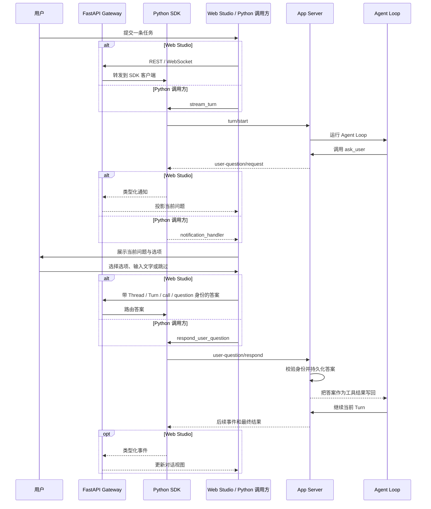

# 怎样创建一个可交互、可恢复的 Agent 会话

个人 Agent 不只要接收用户的一条提示词、返回一段文本。做计划时，它可能需要确认关键选择；执行过程中，它也可能需要补充一个只有用户知道的信息。把问题拼进一条新提示词虽然容易，却会把“Agent 正在做的事”和“用户的回答”拆成两轮，客户端也很难知道应该恢复哪段工作。

Mini Agent 用 App Server 内置的 `ask_user` 工具处理这类交互：Agent 在当前 Turn 中提出一个有类型的问题，客户端收集回答并交回 App Server，App Server 再把回答作为工具结果交还给同一个 Agent Loop。想做个人助手，可以直接从 Harness 提供的 [Python Cookbook 示例](https://github.com/civaapple-alt/mini-agent-harness/blob/main/cookbook/python-demo/08_personal_agent.py)开始。

## 先分清会话、对话和一轮执行

“会话”常被用来泛指整个聊天窗口，但程序需要区分几个不同生命周期：

| 对象 | 回答的问题 | 在交互中的作用 |
| --- | --- | --- |
| Session | 哪些长期状态要跨进程保留？ | 保存执行和对话检查点；使用命名 Session 可在之后重新附着。 |
| Thread | 用户正在查看哪段对话？ | 持有用户消息、Agent 回复和事件的对话身份。 |
| Turn | Agent 现在正在完成哪项工作？ | 从用户提示开始；Agent 提问时等待，收到回答后继续同一个 Turn。 |
| User question | Agent 当前需要用户决定或补充什么？ | 标识当前问题、选项、答案进度，以及所属的 Thread、Turn 和工具调用。 |

`ask_user` 是 Agent 主动发起的澄清问题。它和工具审批不同：审批由 Host 根据执行策略要求用户允许某项操作；它也和执行恢复核对不同：恢复核对用于处理“工具可能已经产生副作用，但结果没来得及写入检查点”的情况。三个交互都需要人参与，但各自回答的问题不同，不能把它们合成一个通用确认弹窗。

## 一次问答怎样走完同一个 Turn

Python SDK、Web Studio 等客户端负责呈现问题和发送答案。App Server 持有问题状态，控制 Agent Loop 并负责持久化；Gateway 只做项目和 Thread 路由。



一个工具调用最多包含三个问题；运行时每次只显示当前问题。选项可以带说明和推荐理由，但“推荐”不会自动选中或提交。自由文本与跳过能力由问题本身声明。答案发回时携带 `interaction_id`、`thread_id`、`turn_id`、`call_id` 和 `question_id`，App Server 会检查它是否仍对应当前问题，并在确认响应前保存答案。

## 先让客户端声明交互能力

SDK 默认关闭用户提问能力。创建客户端时设置 `user_questions=True`，SDK 会在 `initialize` 中声明 `userQuestions`；App Server 只有在收到该能力后才会向这个客户端开放 `ask_user`。通知回调接收类型化的 `UserQuestionNotification`，可从中读取当前问题和交互身份。

下面的代码展示命令行个人 Agent 的核心问答路径。它省略了错误处理和持续输入循环；完整、可直接运行的 Session 恢复流程见 Cookbook 示例。

```python
import asyncio

from mini_agent import (
    MiniAgentClient,
    UserQuestionAnswer,
    UserQuestionNotification,
)


async def read_line(prompt: str) -> str:
    return await asyncio.to_thread(input, prompt)


async def choose_answer(question):
    print(f"\nAgent asks: {question.prompt}")
    for index, option in enumerate(question.options, start=1):
        marker = " (recommended)" if option.recommended else ""
        print(f"  {index}. {option.label}{marker}")
        if option.description:
            print(f"     {option.description}")

    while True:
        value = await read_line("Answer: ")
        if question.allow_skip and value.strip().lower() == "skip":
            return UserQuestionAnswer.skipped()
        if value.isdigit():
            index = int(value) - 1
            if 0 <= index < len(question.options):
                return UserQuestionAnswer.for_option(question.options[index].id)
        if question.allow_free_text and value.strip():
            return UserQuestionAnswer.free_text(value)
        print("Choose an option, enter text, or type 'skip' when allowed.")


client: MiniAgentClient
responding: set[tuple[str, int]] = set()


async def handle_notification(notification: dict) -> None:
    typed = notification.get("typed_user_question")
    if not isinstance(typed, UserQuestionNotification):
        return
    if typed.phase not in {"requested", "updated"}:
        return

    interaction = typed.interaction
    question = interaction.current_question
    if question is None:
        return
    if (
        interaction.current_index < len(interaction.answers)
        and interaction.answers[interaction.current_index] is not None
    ):
        return
    key = (interaction.interaction_id, interaction.current_index)
    if key in responding:
        return

    responding.add(key)
    try:
        await client.respond_user_question(
            interaction_id=interaction.interaction_id,
            thread_id=interaction.thread_id,
            turn_id=interaction.turn_id,
            call_id=interaction.call_id,
            question_id=question.id,
            answer=await choose_answer(question),
        )
    finally:
        responding.discard(key)


client = MiniAgentClient(
    user_questions=True,
    notification_handler=handle_notification,
)
```

在主协程中，通过 `async with client` 管理 App Server 子进程，调用 `initialize()` 和 `start_thread()`，然后使用 `stream_turn(prompt, thread_id=...)` 启动并观察 Turn。`stream_turn()` 返回事件封套；用户问题通过 SDK 的通知回调抵达，不是一个新的 Turn。提交答案后，App Server 将它作为 `ask_user` 的工具结果交回 Agent，后续事件仍属于原来的 Turn。

选项答案使用稳定的 `option.id`，而不是用户可见的标签；文字和跳过分别用 `UserQuestionAnswer.free_text()`、`UserQuestionAnswer.skipped()` 创建。示例用 `(interaction_id, current_index)` 避免同一问题被并发提示两次。自定义回调也应按交互和问题身份处理并发或重试，避免提交两份不同答案。

## 给个人 Agent 一个可重新附着的 Session

进程内变量只在本次程序运行期间存在。要让个人 Agent 在退出后延续对话，应让 App Server 创建或附着命名 Session，并始终使用同一个 ID：

```python
client = MiniAgentClient(
    env={
        "MINI_AGENT_SESSION_MODE": "named",
        "MINI_AGENT_SESSION_ID": "personal-agent",
    },
    user_questions=True,
    notification_handler=handle_notification,
)
```

初始化后调用 `read_thread()` 可以读取当前 Thread 的检查点。若程序重启时正等待用户回答，`ThreadCheckpoint.pending_user_question` 会带回尚未完成的交互；可用 `UserQuestionInteraction.from_dict()` 还原，再按其中的 `current_index` 继续处理。恢复时使用原来的身份字段提交答案。不要在 Gateway 或浏览器里另存一份权威问题状态，也不要把恢复出的答案改成一条新用户提示词。

需要运行完整示例时，在 Harness 仓库根目录准备兼容的 App Server 和模型 Provider：

```bash
cargo build --release --locked -p mini-agent-app-server
export MINI_AGENT_APP_SERVER_PATH="$PWD/target/release/mini-agent-app-server"
uv run --project sdk/python python cookbook/python-demo/08_personal_agent.py
```

Cookbook 示例默认使用 `personal-agent` Session；可通过 `MINI_AGENT_SESSION_ID` 选择自己的 ID。SDK 也可以从 `PATH` 查找 App Server。Provider 配置入口见 Harness [配置文档](https://github.com/civaapple-alt/mini-agent-harness/blob/main/docs/configuration.md)。

如果检查点显示的是 `execution_recovery`，而不是 `pending_user_question`，那是另一种恢复情况：先按 App Server 恢复状态处理可能未完成的工具调用，再显式恢复原 Turn。不要仅因进程重启就再次执行一条副作用尚不明确的命令；[执行检查点说明](../child-tasks.md#main-与-child-的执行检查点)介绍了核对与恢复的边界。

## Web Studio 沿用相同的权威边界

Web Studio 的用户仍通过浏览器回答，但这不会改变谁拥有交互状态：

1. Gateway 为 SDK 客户端声明 `user_questions=True`。
2. App Server 发送 `user-question/request` 或 `user-question/updated`，SDK 将其交给 WebSocket 消息流和通知处理器。
3. 前端显示当前问题；回答通过 Gateway 的 `user-questions/respond` 路由回对应 Thread 的 App Server。
4. App Server 校验问题身份并保存答案，再恢复原 Agent Loop。

因此，页面刷新后应从 App Server 读取 `pending_user_question`，而不是依赖浏览器输入框仍在内存中。Web Studio 目前由 [ClientPool](../../server/control/client_pool.py)、[Agent Turn 路由](../../server/routes/agent_turns.py)、[回答卡片](../../frontend/src/components/UserQuestionCard.jsx) 和 [用户提问参考](../user-questions.md)组成这条路径。

## 什么时候提问，什么时候继续自己做

提问会暂停一个正在运行的 Turn，也会增加一次往返。模型能从工作区或已有会话中找到答案时，应先检查这些来源；当用户的偏好、安全决定或领域知识会改变执行方向时，再使用 `ask_user`。每次围绕一个决定提问，给出短而互斥的选项，并用说明解释影响。若自由文本已经足够，就不要强迫用户从近似选项中猜一个。

把 Agent 主动澄清、敏感工具审批和执行结果核对分别交给各自的状态与接口，个人 Agent 才能在等待、回答、断线和重启后仍然知道自己在哪个 Thread、Turn 和工具调用里。

## 代码与规范入口

- [Agent 问答：Web Studio 的展示和恢复规则](../user-questions.md)。
- [Python SDK 用法](https://github.com/civaapple-alt/mini-agent-harness/blob/main/sdk/python/README.md)。
- [完整个人 Agent 示例](https://github.com/civaapple-alt/mini-agent-harness/blob/main/cookbook/python-demo/08_personal_agent.py)。
- [SDK 问题交互类型与回答方法](https://github.com/civaapple-alt/mini-agent-harness/blob/main/sdk/python/src/mini_agent/types.py) 与 [client.py](https://github.com/civaapple-alt/mini-agent-harness/blob/main/sdk/python/src/mini_agent/client.py)。
- [App Server 的用户问题协议处理](https://github.com/civaapple-alt/mini-agent-harness/blob/main/crates/mini-agent-app-server/src/json_rpc.rs) 与 [执行运行时](https://github.com/civaapple-alt/mini-agent-harness/blob/main/crates/mini-agent-app-server/src/worker.rs)。
- [Web Studio 用户提问契约](../user-questions.md) 与 [本地开发入口](../../README.md#同时开发-harness-sdk)。
