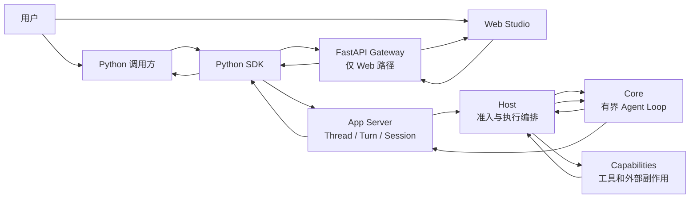

# 01 从个人助理愿景到会话模型

你提到的个人助理愿景类似 Meta Muse 或 Grok bots，可能需要长期记住用户的偏好，也可能跨越多次交互去比价、整理邮件或安排日程。这样的产品首先需要的不是一个更长的提示词，而是一套能回答“现在是谁在做什么、用户怎样介入、进程中断后从哪里接上”的会话模型。

这类个人助理目前是产品愿景。Mini Agent 当前提供的是可复用的 Agent 运行时；SDK 示例 `08_personal_agent.py` 展示命名 Session、持续对话、`ask_user` 和恢复边界，不提供上述领域能力。

## 先把成功条件写清楚

把一次交互式运行定义成几个可观察的要求：

1. 用户和客户端能引用同一段对话以及同一轮工作。
2. 等待用户回答时，答案能回到发起问题的工具调用和 Turn。
3. 工具执行产生副作用前，有明确的准入与审批边界。
4. 断线和进程重启后，客户端能读回权威状态；未知副作用不会被当成失败后盲目重跑。
5. 每个状态转换都能通过 ID、事件和持久记录验证，而不是从回复文本猜测。

这些要求对应不同生命周期。把它们压进一个“聊天记录”对象，会让客户端无法判断重试、继续或新开对话分别作用于哪里。

## 四类身份回答四个问题

| 对象 | 回答的问题 | 当前运行时中的作用 |
| --- | --- | --- |
| Session | 哪些运行状态要跨进程保留？ | App Server/SessionStore 的持久化边界；SDK 可请求新建、命名、恢复或 fork Session。 |
| Thread | 用户正在读取或控制哪段对话？ | 对话历史、活动和运行控制的可寻址身份。请求必须沿用服务端返回的 ID。 |
| Turn | 当前这项 Agent 工作从哪里开始、怎样结算？ | 一次逻辑运行；恢复继续原 Turn，不另建一轮来伪装续接。 |
| Operation | 一项较长工作或委派经历了哪些尝试？ | Child 等控制面任务跨越排队、运行、暂停和完成；每个 attempt 可有自己的 Turn。 |

工具调用和交互也有自己的身份。工具调用以模型 `callId` 关联生命周期与结果；用户问题再带有 interaction/question 身份。恢复请求绑定原 `turnId`、checkpoint 序号与 request ID。它们不是 UI 标签，而是拒绝迟到、重复或冲突操作的依据。

Python SDK 可直接连接 App Server；Web Studio 经 Gateway 和 SDK 使用同一个运行时。Gateway 把 Project/Thread 路由到服务端，浏览器展示状态并发送用户控制动作。Gateway 和浏览器都不另建 Agent Loop，也不成为 Session 历史、执行权限或恢复状态的权威来源。

## 为什么要区分身份

“继续”有几种完全不同的含义：

- 继续回答一个未完成的 `ask_user` 问题：同一交互、同一工具调用、同一 Turn。
- 从停滞的执行检查点恢复：同一 Thread 和 Turn，使用服务端最新的 checkpoint 序号。
- 重试已失败的 Child operation：同一 operation 的新 attempt，通常创建新的 Child Turn。
- 用户补充新要求：通常启动一个新 Turn，而不是篡改旧 Turn 的输入。

如果客户端只保存一份滚动聊天文本，就无法可靠表达这些区别。可恢复会话要求身份在 UI、SDK、Gateway 和 App Server 之间原样传递，并由创建该身份的服务端校验。

## 本篇结论

先建模生命周期，再设计聊天界面。用户可见的“会话”“等待”“继续”按钮，必须对应具体的 Session、Thread、Turn、Operation 或交互状态。用户的个人助理愿景可以指导未来增加哪些领域能力，但不应反过来改写当前 SDK 示例的含义。

下一篇会把用户介入拆成不同控制动作：[02 把交互做成明确的控制动作](02-interaction-and-control.md)。

## 代码与规范入口

- [Harness 运行时架构](https://github.com/civaapple-alt/mini-agent-harness/blob/main/docs/harness-framework.md)
- [App Server Thread/Turn 方法](https://github.com/civaapple-alt/mini-agent-harness/blob/main/docs/app-server.md)
- [Python SDK 的 Session 和 Thread API](https://github.com/civaapple-alt/mini-agent-harness/blob/main/sdk/python/src/mini_agent/client.py)
- [Web Studio 运行关系](../../../README.md#运行关系)
- [Cookbook `08_personal_agent.py`](https://github.com/civaapple-alt/mini-agent-harness/blob/main/cookbook/python-demo/08_personal_agent.py)
