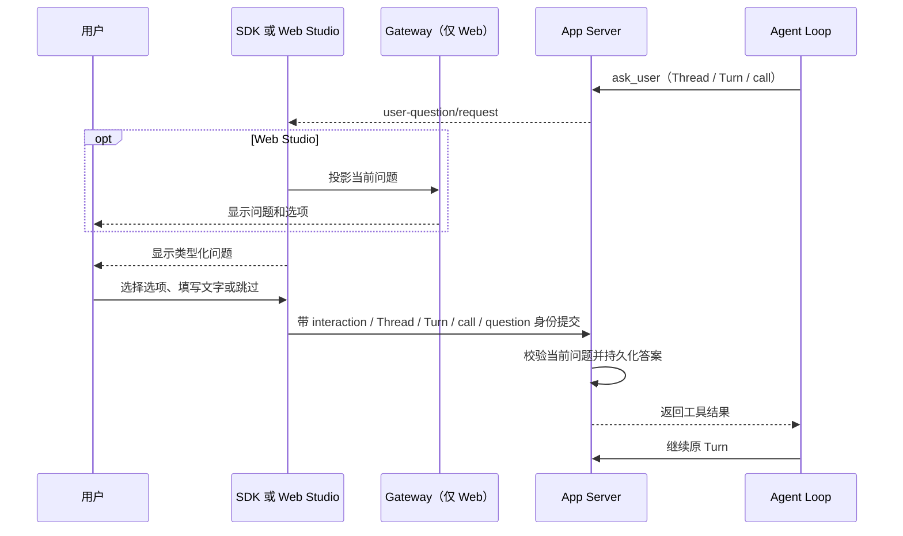

# 02 把交互做成明确的控制动作

用户参与 Agent 工作，不只有“回答一个问题”。用户可能需要澄清偏好、批准副作用、在运行中改变重点、请求停止，或在重启后确认工具是否已经完成。它们发生在不同时间，回答不同的问题，也必须触发不同的运行时转换。

## 五种交互不要合成一个确认框

| 控制动作 | 何时发生 | 保存或改变什么 | 继续时的语义 |
| --- | --- | --- | --- |
| Agent 提问（`ask_user`） | Agent 在工作中缺少用户拥有的信息或决定 | App Server 保存问题、当前进度和答案 | 将答案作为工具结果写回原调用，继续原 Turn |
| 工具审批 | 工具副作用执行之前 | Host 判断操作是否需要用户授权；授权匹配结构化动作身份与范围 | 获准后再执行这条工具调用 |
| Steering | Turn 仍在运行时用户补充方向 | 把有界指令交给当前 Turn | 运行时在安全边界处理，仍是同一 Turn |
| Interrupt | 用户请求停止当前 Turn | 提交协作式取消请求 | 到达安全边界并结算后才算停止；收到接受响应不等于已结束 |
| 执行结果核对 | 工具已开始，但重启前没有持久结果 | 操作者提交可复查依据及已完成结果，或确认尚未执行 | 核对不会自动运行工具；全部处理后还要显式恢复原 Turn |

如果把这些动作都做成通用的 `confirm` 对话框，客户端会丢掉关键信息：用户是在授权未来动作、回答 Agent 的问题，还是判断一个已经可能发生的副作用？这种差异决定下一步能否安全执行。

## 以 Agent 提问为例：答案属于原调用

当前 `ask_user` 只会向在 `initialize` 中声明 `userQuestions` 的 App Server 客户端开放。一个工具调用最多包含三个顺序问题；每个问题最多六个选项，也可以允许自由文本或跳过。推荐选项只是呈现建议，不会被自动选中。

App Server 在确认答案前持久化；重复提交同一个已接受答案是幂等的，冲突答案、过期问题或乱序问题会被拒绝。刷新后，客户端从 `thread/read` 读取待回答问题；它不依赖浏览器内存，也不会把答案伪装成一条新用户消息。

## 让客户端只呈现服务端状态

Web Studio 的调用路径是 `浏览器 → FastAPI Gateway → Python SDK → App Server`。Gateway 负责 Project 和 Thread 路由，把 SDK 事件映射成 WebSocket/REST 投影；回答仍提交给拥有该交互状态的 App Server。Python 调用方可以绕过 Gateway，直接用 SDK 通知回调处理问题。

同样的原则适用于审批、停止和恢复：页面收到审批请求才呈现审批卡；停止接受后仍等待 `turn_finished` 或读取终态；工具结果未知时，界面从 `turn/read` 投影检查点，并要求逐条核对。客户端不能根据错误文本猜权限或执行结果。

## 设计取舍：类型化动作增加协议，但减少歧义

单个通用交互接口较容易接入，但会让每个客户端自己猜问题是否过期、批准是否仍有效、停止是否已结算以及工具是否可重跑。当前设计把动作拆分到对应的 App Server 方法和结构化通知中，代价是协议与 UI 需要处理更多状态。对于长时间运行且会操作外部资源的 Agent，这个复杂度换来可验证的生命周期与更安全的故障处理。

下一篇解释这些状态如何写入 Session，并在重启后复原：[03 让持久化与恢复尊重副作用](03-persistence-and-recovery.md)。

## 代码与规范入口

- [App Server 的用户问题契约](https://github.com/civaapple-alt/mini-agent-harness/blob/main/docs/app-server.md#interactive-user-questions)
- [Web Studio 的 Agent 提问行为](../../user-questions.md)
- [Web Studio 的 Turn、事件与重连](https://github.com/civaapple-alt/mini-agent-harness/blob/main/docs/studio-integration.md#turn-事件与重连)
- [Web Studio WebSocket 路由](../../../server/routes/agent_ws.py)
- [Web Studio Agent Turn 路由](../../../server/routes/agent_turns.py)
