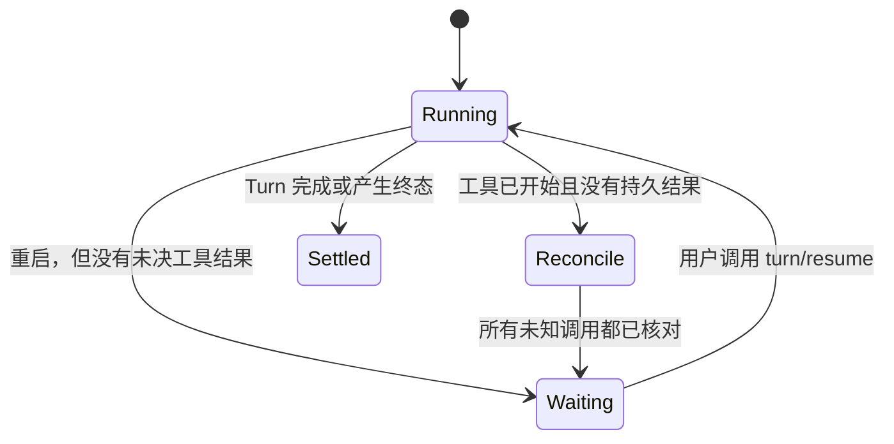

# 03 让持久化与恢复尊重副作用

保存聊天历史能回答“用户说过什么”，却不能回答“工具是否已经完成”。可恢复 Agent 必须分别记录已结算的对话上下文、当前 Turn 的下一步位置，以及工具副作用和结果是否已经持久化。

## 两类检查点，两种用途

| 状态 | 保存什么 | 用途 |
| --- | --- | --- |
| Session checkpoint | 已结算 Turn 的对话上下文 | 后续 Turn 和 Child fork 从已确认的上下文开始 |
| Execution checkpoint/journal | 当前逻辑 Turn 的输入、模型上下文、阶段、下一步位置和工具批次 outcome | 允许操作者继续原 Turn，并避免重复运行已有持久结果 |

App Server 在每次模型请求前和整批工具完成后保存执行检查点。若写入检查点失败，运行时会在下一个模型请求或副作用之前停止。普通 Session checkpoint 不代替正在运行 Turn 的执行日志；执行检查点也不意味着外部系统参与了事务。

## 外部副作用带来一个无法消掉的故障窗口

以“发送一封邮件”为例，执行过程可能是：

```text
请求服务端发送 → 邮件服务接受 → App Server 写入工具结果
                         ↑
               进程可能在这里退出
```

如果进程在邮件服务接受请求后、App Server 保存结果前退出，本地日志只能证明调用开始过，不能证明邮件是否发出。对任意外部服务，Agent 运行时无法靠本地回滚撤销已经发生的操作，也不能安全地把“没有记录结果”解释为“没有副作用”。

App Server 因此将已开始但没有结果的调用标为 `needs_reconciliation`，不会在启动时自动重放。操作者核对目标系统后可以：

- 选择 `completed`，提交可复查依据和实际工具输出。之后继续时复用该结果，不会重跑调用。
- 选择 `not_executed`，确认没有产生副作用。之后显式继续时才会再次执行调用。

核对决定绑定原 `turnId`、checkpoint 序号、`toolCallId` 和 request ID。它只记录决定，不会执行工具，也不会自动恢复 Turn。如果后续重跑再次遇到进程重启，当前结果可能再次未知；先前的“尚未执行”证明不代表这一次也未执行。

## 显式恢复保留原 Turn 身份



`turn/resume` 必须带原 Turn ID、当前 checkpoint 序号和稳定 request ID。App Server 拒绝过期序号，也不会在仍有调用待核对时恢复。重复的已接受恢复请求不会创建新的 Turn 或 Child attempt。恢复中再次断开时，客户端应读取最新 `turn/read`，用服务端的 `running`、`waiting_for_continue` 或 `needs_reconciliation` 状态校正页面。

## 实时事件不是持久历史

Web Studio 的实时事件帮助界面及时更新，但网络连接和进程可随时中断。当前运行时把 `turn/event.sequence` 作为 Thread 内事件游标；有限的重放摘要用于发现缺口和推进游标，不承载聊天正文。出现事件缺口时，Studio 从 `thread/read` 和 `thread/items/list` 重建 canonical 活动，再读取运行状态和待审批项。

这条路径保留三个不同角色：

- **实时事件**：低延迟地显示正在发生的活动。
- **持久 Thread/Turn 投影**：恢复历史活动、结果和可执行状态。
- **恢复核对**：解决日志无法证明副作用是否发生的歧义。

把实时事件缓存当成历史会在重连时丢项；把浏览器状态当成检查点则可能产生第二份权威。客户端只应重建投影，不应因重连自动提交原输入或自动重放工具。

## 这个取舍证明什么，不证明什么

不自动恢复未知工具结果会增加一次人工核对，也会打断自动流程；它保留了“副作用是否发生”这一事实边界。若未来的邮件、采购或日历集成提供稳定幂等键、结果查询和补偿操作，可在各自 Capability 中利用这些契约进一步自动化。没有这类外部契约前，单靠 Agent 的本地 Session 无法保证端到端 exactly-once。

下一篇把这些边界映射到组件和原则：[04 从组件边界推导设计原则](04-components-and-principles.md)。

## 代码与规范入口

- [App Server Turn 执行、恢复与事件方法](https://github.com/civaapple-alt/mini-agent-harness/blob/main/docs/app-server.md#public-json-rpc-interface)
- [Web Studio 的 Turn 重连与 canonical 对账](https://github.com/civaapple-alt/mini-agent-harness/blob/main/docs/studio-integration.md#turn-事件与重连)
- [Session execution journal 的重启处理](https://github.com/civaapple-alt/mini-agent-harness/blob/main/crates/mini-agent-capabilities/src/session.rs)
- [Web Studio 执行检查点说明](../../child-tasks.md#main-与-child-的执行检查点)
